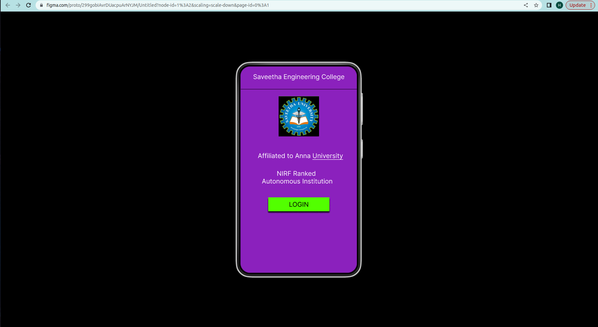
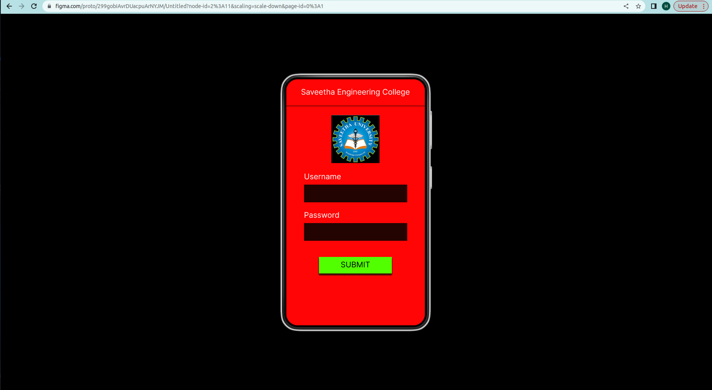
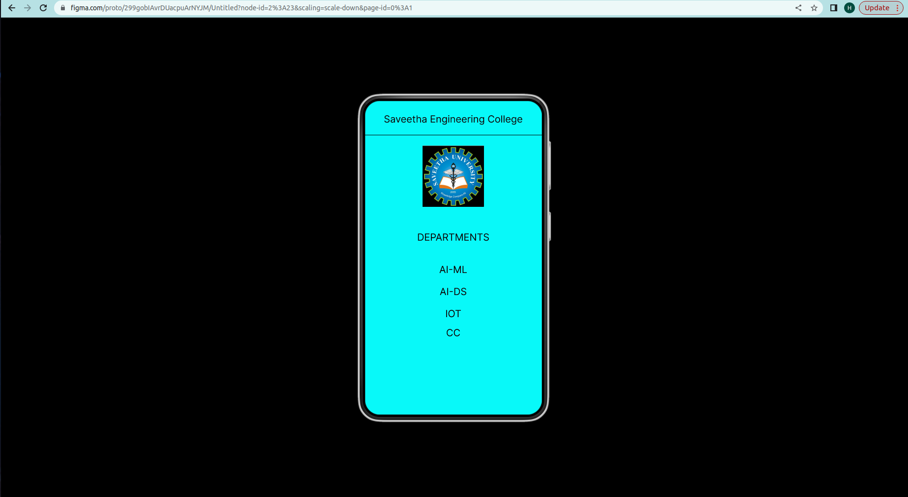

# Ex09 Event Registration Web Application
## Date: 14/11/2023

## AIM:
To design, develop and deploy a web application for event registration.

## DESIGN STEPS:

### Step 1:
Create a new frame.

### Step 2:
Select any one preset size of your choice.

### Step 3:
Select the shapes you need.

### Step 4:
Import images as needed.

### Step 5:
Create pages based on your need and link them.

### Step 6:

Validate the HTML and CSS code.

### Step 6:

Publish the website in the given URL.

## DESIGN TOOL:
FIGMA:
```
/* Rectangle 3 */

position: absolute;
width: 276px;
height: 502px;

background: #F35E5E;


/* Rectangle 2 */

position: absolute;
width: 256px;
height: 502px;

background: #4AE8F2;


/* 1580796818004 1 */

position: absolute;
width: 114px;
height: 111px;

background: url(1580796818004.jpg);
border-radius: 35px;


/* 1580796818004 2 */

position: absolute;
width: 114px;
height: 111px;

background: url(1580796818004.jpg);
border-radius: 35px;


/* USERNAME: */

position: absolute;
width: 116px;
height: 40px;

font-family: 'Inknut Antiqua';
font-style: normal;
font-weight: 400;
font-size: 16px;
line-height: 40px;
/* identical to box height, or 250% */
text-align: center;

color: #000000;


/* Rectangle 4 */

position: absolute;
width: 258px;
height: 494px;

background: #FF8FD9;


/* SAVEETHA ENGINEERING COLLEGE */

position: absolute;
width: 225px;
height: 120px;

font-family: 'Inknut Antiqua';
font-style: normal;
font-weight: 400;
font-size: 16px;
line-height: 40px;
/* or 250% */
text-align: center;

color: #493E5F;


/* SAVEETHA ENGINEERING COLLEGE */

position: absolute;
width: 213px;
height: 50px;

font-family: 'Inknut Antiqua';
font-style: normal;
font-weight: 400;
font-size: 16px;
line-height: 41px;
text-align: center;

color: #FF0707;


/* SAVEETHA ENGINEERING COLLEGE */

position: absolute;
width: 213px;
height: 50px;

font-family: 'Inknut Antiqua';
font-style: normal;
font-weight: 400;
font-size: 16px;
line-height: 41px;
text-align: center;

color: #FFFFFF;


/* AFFILIATED TO ANNA UNIVERSITY */

position: absolute;
width: 188px;
height: 93px;

font-family: 'Inknut Antiqua';
font-style: normal;
font-weight: 400;
font-size: 16px;
line-height: 40px;
/* or 250% */
text-align: center;

color: #FFFFFF;


/* PASSWORD: */

position: absolute;
width: 114px;
height: 40px;

font-family: 'Inknut Antiqua';
font-style: normal;
font-weight: 400;
font-size: 16px;
line-height: 40px;
/* identical to box height, or 250% */
text-align: center;

color: #060505;


/* Rectangle 5 */

position: absolute;
width: 206px;
height: 26px;

background: #D9D9D9;


/* Rectangle 6 */

position: absolute;
width: 206px;
height: 27px;

background: #D9D9D9;


/* DEPARTMENTS CSE IT ECE EEE */

position: absolute;
width: 148px;
height: 200px;

font-family: 'Inknut Antiqua';
font-style: normal;
font-weight: 400;
font-size: 16px;
line-height: 40px;
/* or 250% */
text-align: center;

color: #002E74;


/* 1580796818004 3 */

position: absolute;
width: 114px;
height: 111px;

background: url(1580796818004.jpg);
border-radius: 35px;
```


## OUTPUT:



## RESULT:
The program to design, develop and deploy a web application for event registration is completed successfully.
